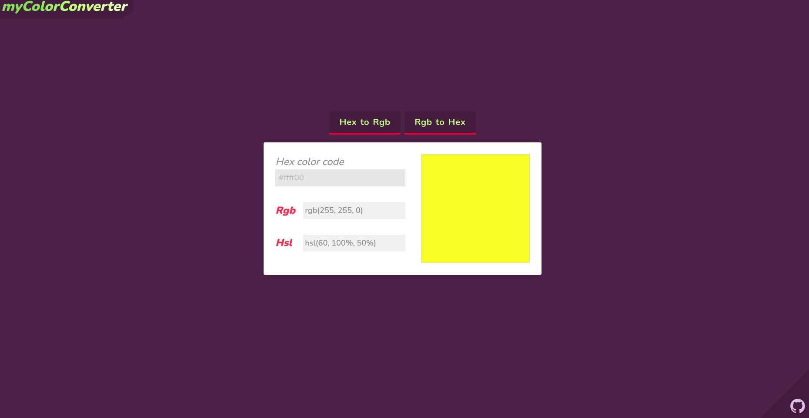

# myColorConverter

- A small web application build on javacript to convert **hex** color
- code to **rgb** && vice-versa.

### Features

- The app will convert a **hex** color code to **rgb** && vice-versa.
- It will also give the corresponding **hsl** color value.
- There is also a **window** to check the color.
- App can be viewed both on dark mode as well as Light Mode.

### Screenshot

> Checkout the [app](https://mycolorconverter.netlify.app/).
